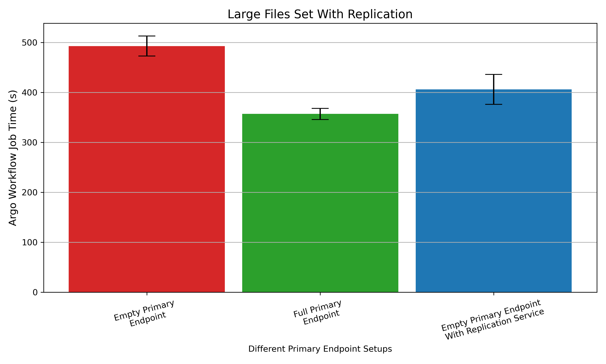
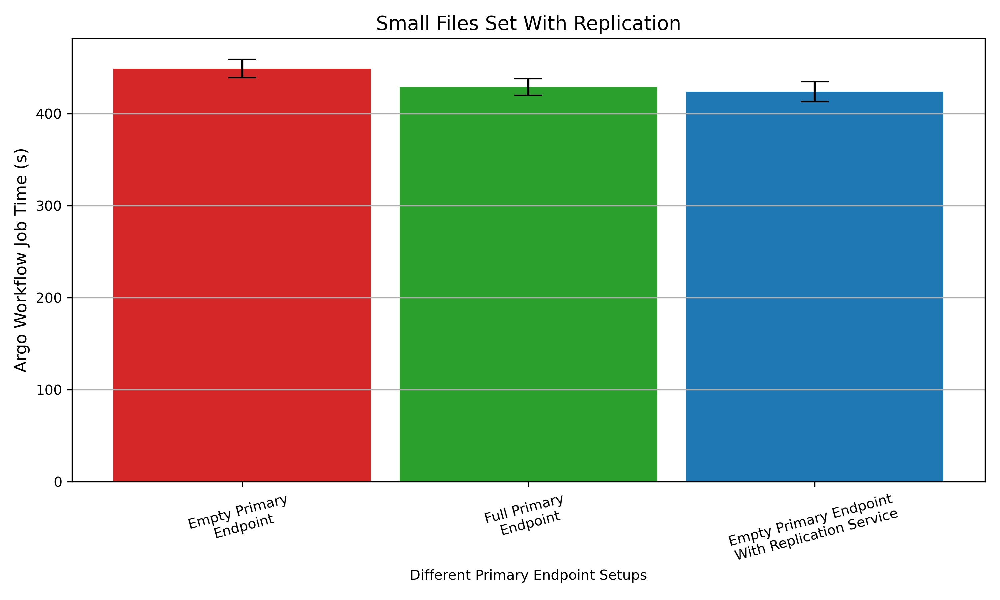

# ArgoReplicationEndToEndTest

This test will show the improvement performance of using the replication service. The performance is measured as time a Argo job takes to complete. 

The test will consist of three different performance steps:
- Without using Replication Service and a defined starting stage
- Using Replication Service and no files on primary
- Using Replication Service repeating the jobs

The starting stages will in itself consist of three starting points:
- No files on the primary endpoint
- Half the files on the primary endpoint
- All the files on the primary endpoint.

The test will also be performed on four datasets:
- Base set of small and large files
- Set of small files varying in size
- Set of large files varying in size.

Here small is defined as files below <1MB. The data is not accounted for stochanistic/entropic types of data. This test is only to show performance in creases in job time, not in transver optimilisation. The data used is from the Napierone dataset (http://napierone.com/Website/index.html).

All test are run on the same machine inside a virtual machine. Used hardware:
- AMD Ryzen 7 5800X 8-Core Processor
- 3200 MT/s

VM Settings:
- 12000 MB Ram
- 16 Processors

# Baseset result

The baseset results show that without replication service there is a clear improvement of having files already available on the UvA Minio. A test with the replication service show that having it enabled, similar performance as having every file on the primary endpoint.

# Large files result

Large files with a replication service show a clear benefit of using it. It improve the time by roughly 80 seconds.

# Small files result

Small files do not show that much improvement, with or without the replication service. Further the data of having a replication service is even faster then without and having every file available. This indicates that while multiple samples have been taken, the margin of improvement is minimal.

## Appendix: Defined Datasets

The defined dataset shows all files. The half data set is the files split in half rounded up.

### Base set

Filesize (Bytes) | Filename
--|--
515528 | dataset_basetest/0210-csv.csv
43164 | dataset_basetest/0298-csv.csv
6844 | dataset_basetest/0402-csv.csv
192407 | dataset_basetest/0433-csv.csv
169 | dataset_basetest/0683-csv.csv
2027820 | dataset_basetest/0735-csv.csv
21707 | dataset_basetest/0822-csv.csv
1219 | dataset_basetest/0977-csv.csv

### Smallfiles set

Filesize (Bytes) | Filename
--|--
10871 | dataset_fewsmallfiles/0007-csv.csv
22981 | dataset_fewsmallfiles/0012-csv.csv
10404 | dataset_fewsmallfiles/0016-csv.csv
10638 | dataset_fewsmallfiles/0017-csv.csv
9238 | dataset_fewsmallfiles/0018-csv.csv
10725 | dataset_fewsmallfiles/0022-csv.csv
61696 | dataset_fewsmallfiles/0043-csv.csv
39712 | dataset_fewsmallfiles/0048-csv.csv
40475 | dataset_fewsmallfiles/0064-csv.csv
2035 | dataset_fewsmallfiles/0076-csv.csv
65746 | dataset_fewsmallfiles/0083-csv.csv
59605 | dataset_fewsmallfiles/0084-csv.csv
21398 | dataset_fewsmallfiles/0087-csv.csv
42712 | dataset_fewsmallfiles/0094-csv.csv
233081 | dataset_fewsmallfiles/0115-csv.csv
21865 | dataset_fewsmallfiles/0132-csv.csv
5646 | dataset_fewsmallfiles/0135-csv.csv
142252 | dataset_fewsmallfiles/0150-csv.csv
2029 | dataset_fewsmallfiles/0168-csv.csv
5257 | dataset_fewsmallfiles/0173-csv.csv
112745 | dataset_fewsmallfiles/0188-csv.csv

### Large set

Filesize (Bytes) | Filename
--|--
14858107 | dataset_largeFiles/0001-TIF.TIF
20576481 | dataset_largeFiles/0002-TIF.TIF
32806633 | dataset_largeFiles/0003-TIF.TIF
25524457 | dataset_largeFiles/0004-TIF.TIF
21221421 | dataset_largeFiles/0005-TIF.TIF
19418531 | dataset_largeFiles/0006-TIF.TIF
19865964 | dataset_largeFiles/0007-TIF.TIF
32851324 | dataset_largeFiles/0008-TIF.TIF
22221210 | dataset_largeFiles/0009-TIF.TIF
29513168 | dataset_largeFiles/0010-TIF.TIF
21091083 | dataset_largeFiles/0011-TIF.TIF
29442853 | dataset_largeFiles/0012-TIF.TIF
26530338 | dataset_largeFiles/0013-TIF.TIF
16283653 | dataset_largeFiles/0014-TIF.TIF
22541665 | dataset_largeFiles/0015-TIF.TIF
26897283 | dataset_largeFiles/0016-TIF.TIF
24696095 | dataset_largeFiles/0017-TIF.TIF
26058906 | dataset_largeFiles/0018-TIF.TIF
28896050 | dataset_largeFiles/0019-TIF.TIF
18989398 | dataset_largeFiles/0020-TIF.TIF
