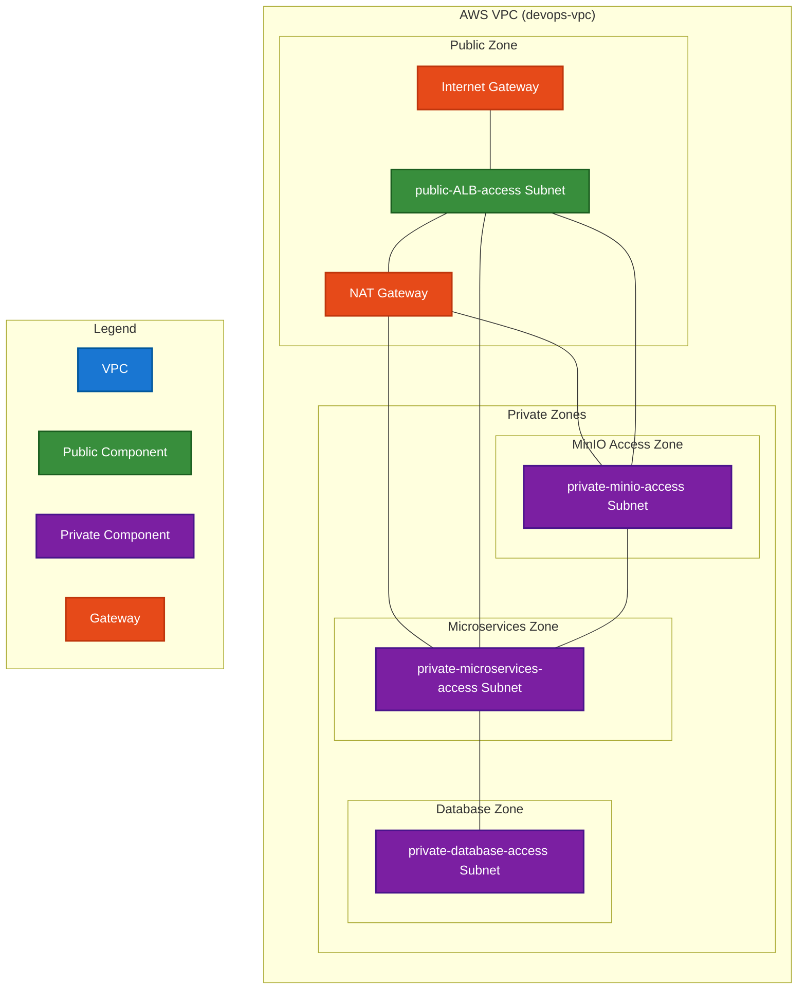
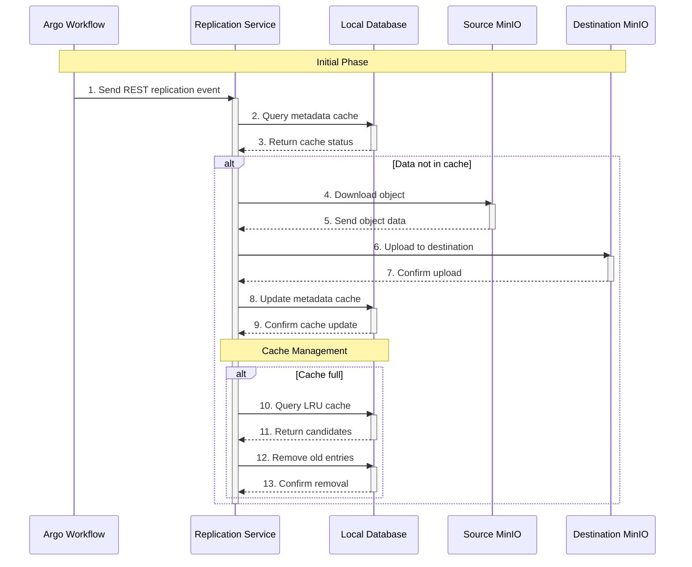

# AWS Cloud System Architecture Documentation

## **Overview**
This document provides a comprehensive overview of the AWS Virtual Private Cloud (VPC) network architecture. It details the components of the network, including subnets, routing tables, gateways, instances, security groups, and the overall purpose of the system. 

The primary goal of this system is to **enable just-in-time data replication** for an existing **scientific data processing system**. The system currently consists of an **Argo Workflow Controller** and **two MinIO instances**, both **external** to this AWS network. The data processed in this system consists of **LiDAR information about European animal populations and forestry conditions**, used to derive insights into **nature wellbeing**.

### **Problem Statement & Just-in-Time Replication**
The Argo Workflow Controller is fed with **YAML processing jobs**, originating from **Jupyter Python snippets** that are converted into **Argo workflows**. However, the **workflow data is large** and primarily stored on a **remote MinIO instance in Spain**. Due to the **large geographical distance**, the **bandwidth is low**, leading to **slow workflow execution** since:

- Each workflow **retrieves data sequentially**, meaning gaps in data transfer occur between workflow steps.
- The **local MinIO instance** near the Argo Workflow Controller is **preferred** due to its faster access speed.
- The **local MinIO instance has limited storage** and cannot house all necessary data from the remote MinIO instance.

To **solve these issues**, this AWS-based **Replication Service** is implemented. This microservice ensures **proactive data replication** by prefetching required workflow data **before it is needed**.

## **System Architecture**

### **Core Components**

#### **Virtual Private Cloud (VPC)**
- **Name:** `devops-vpc`
- **CIDR Block:** `10.0.0.0/16`
- **DNS Hostnames:** Enabled
- **DNS Resolution:** Enabled
- **Purpose:**
  - Hosts all resources in an isolated network environment.
  - Ensures controlled access to external and internal services.
  - Segments different workloads across multiple subnets.

#### **Subnets & Purpose**
The system consists of **four subnets**, categorized as public and private subnets:

| **Subnet Name**               | **Type**    | **CIDR Block**     | **Purpose** |
|--------------------------------|------------|--------------------|-------------|
| `public-ALB-access`           | Public     | `10.0.1.0/24`      | Hosts the **Application Load Balancer (ALB)** to distribute external traffic. |
| `private-microservices-access`| Private    | `10.0.2.0/24`      | Hosts **Replication Service instances** in an Auto Scaling Group. |
| `private-database-access`      | Private    | `10.0.3.0/24`      | Hosts the **relational database** used as a cache for replicated data tracking. |
| `private-minio-access`        | Private    | `10.0.4.0/24`      | Hosts **local MinIO and Argo Workflow Controller instances** used for testing purposes . |

### **Network Topology**

The diagram illustrates the complete network topology with the following key elements:

- Blue represents the VPC container
- Green components are in the public zone (accessible from internet)
- Purple components are in private zones (isolated from internet)
- Orange components are gateways (Internet Gateway and NAT Gateway)
- Lines between components show direct network connectivity

### **Routing Tables and Traffic Flow**
Routing tables dictate how traffic moves between different parts of the VPC and external networks.

| **Route Table Name**             | **Associated Subnet(s)**            | **Routes** |
|----------------------------------|------------------------------------|------------|
| `public-route-table`             | `public-ALB-access`                | `0.0.0.0/0 → Internet Gateway` |
| `private-microservices-access-rt` | `private-microservices-access`     | `0.0.0.0/0 → NAT Gateway`, `10.0.0.0/16 → local` |
| `private-database-access-rt`     | `private-database-access`          | `10.0.0.0/16 → local` |
| `private-minio-access-rt`        | `private-minio-access`             | `0.0.0.0/0 → NAT Gateway`, `10.0.0.0/16 → local` |

### **Traffic Routing Explanation**
- **Public ALB Access Subnet (`public-ALB-access`)**: 
  - Directs **incoming REST API requests** from Argo Workflow Controller to **Replication Service instances**.
  - Uses an **Internet Gateway** for outbound internet connectivity.
- **Private Microservices Subnet (`private-microservices-access`)**:
  - Accepts traffic from **ALB → Target Group**.
  - Routes outbound traffic (e.g., to external MinIO instances) **via NAT Gateway**.
  - Can access the **internal database** directly over VPC private networking.
- **Private Database Subnet (`private-database-access`)**:
  - Restricts all traffic except **Replication Service → Database connections**.
- **Private MinIO Subnet (`private-minio-access`)**:
  - Used to host **local MinIO and Argo Workflow Controller EC2 instances** that are used for testing (not part of production).
  - Routes **outbound traffic to external MinIO instances via NAT Gateway**.

### **Replication Service Flow**

The sequence diagram above illustrates the complete replication flow with the following key elements:

- Solid arrows (→) represent requests/actions
- Dashed arrows (-->) represent responses
- Vertical bars show when each service is actively processing
- The `alt` blocks show conditional flows (if/then scenarios)

### **Security Considerations**

1. **Network Isolation**  - Public components (ALB, NAT Gateway) are isolated in their own subnet
  - Private components (Replication Service, Database, MinIO) are restricted to internal access
  - Database subnet has no external connectivity

2. **Traffic Control**  - Inbound traffic restricted through ALB security groups
  - Outbound traffic controlled via NAT Gateway
  - Internal subnet communication managed through route tables

3. **Component Security**  - Replication Service instances protected by Auto Scaling Group
  - Database access restricted to Replication Service only
  - MinIO instances isolated in private subnet

### **System Operation**

1. **Workflow Processing**  - Argo Workflow Controller initiates replication through REST API
  - Application Load Balancer distributes traffic to available Replication Service instances
  - Replication Service checks local cache before initiating transfers
  - Cache management ensures efficient storage utilization

2. **Data Management**  - Local MinIO instance stores prefetched data
  - Database maintains metadata for tracking and cache management
  - LRU cache strategy ensures optimal storage utilization
  - System maintains data consistency between source and destination

### **Scalability and Reliability**

1. **Auto Scaling**  - Replication Service instances scale based on workload
  - Maintains optimal instance count for processing demands
  - Ensures consistent performance under varying loads

2. **High Availability**  - Multiple Availability Zones for critical components
  - Redundant network paths through route tables
  - Isolated components prevent cascading failures

### **Monitoring and Maintenance**

1. **Performance Monitoring**  - System tracks replication latency
  - Monitors cache hit rates
  - Measures storage utilization

2. **System Health**  - Continuous monitoring of component status
  - Automatic failure detection
  - Proactive maintenance capabilities

## **Conclusion**
This AWS network architecture **optimizes data replication for Argo Workflows**, ensuring that scientific data processing is not bottlenecked by **slow data retrieval from remote storage**. The **Replication Service reduces workflow execution time** by ensuring data is **prefetched and available before it's needed**. The **local MinIO cache** is intelligently managed to balance storage limitations with access speed.

This system is **scalable**, **secure**, and **integrated with external data sources**, providing a **foundation for efficient large-scale scientific computation**.
