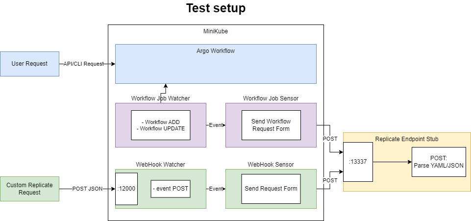

# Argo-api Test Enviroment

This folder creates a test enviroment to help investigate Argo its event watcher functionality. The instructions below describe:
- Installing requirements
- Starting Argo
- Starting python sample server
- Configuring either
	- Webhook Event Watcher/Sensor
	- Argo Workflow Event Watcher/Sensor
- Testing the created Watchers and Sensors
- Shutting down argo pods

Spawning everything will result the following setup:



# Requirements

## Install minikube

```bash
curl -LO https://github.com/kubernetes/minikube/releases/latest/download/minikube-linux-amd64
sudo install minikube-linux-amd64 /usr/local/bin/minikube && rm minikube-linux-amd64
```

## Install kubectl

```bash
curl -LO "https://dl.k8s.io/release/$(curl -L -s https://dl.k8s.io/release/stable.txt)/bin/linux/amd64/kubectl"
curl -LO "https://dl.k8s.io/release/$(curl -L -s https://dl.k8s.io/release/stable.txt)/bin/linux/amd64/kubectl.sha256"
echo "$(cat kubectl.sha256)  kubectl" | sha256sum --check
sudo install -o root -g root -m 0755 kubectl /usr/local/bin/kubectl
rm kube*
```

## Install ansible

```bash
sudo apt update
sudo apt install software-properties-common
sudo add-apt-repository --yes --update ppa:ansible/ansible
sudo apt install ansible
```

## Install Argo Workflow

```bash
kubectl create namespace argo
kubectl apply -n argo -f "https://github.com/argoproj/argo-workflows/releases/download/v3.6.4/quick-start-minimal.yaml"
```

## Install Argo events

```bash
kubectl create namespace argo-events
kubectl apply -n argo-events -f https://raw.githubusercontent.com/argoproj/argo-events/stable/manifests/install.yaml
```

## Install argo CLI:

```bash
# Argo isntall
# Detect OS
ARGO_OS="darwin"
if [[ uname -s != "Darwin" ]]; then
  ARGO_OS="linux"
fi

# Download the binary
curl -sLO "https://github.com/argoproj/argo-workflows/releases/download/v3.6.4/argo-$ARGO_OS-amd64.gz"

# Unzip
gunzip "argo-$ARGO_OS-amd64.gz"

# Make binary executable
chmod +x "argo-$ARGO_OS-amd64"

# Move binary to path
mv "./argo-$ARGO_OS-amd64" /usr/local/bin/argo

# Test installation
argo version
```

# How to use

Start minikube:
```bash
minikube start --driver=docker
```

## Launch argo
Run ansible for launching argo:
```bash
ansible-playbook SetupArgo.yaml
```

## Launch Python Endpoint

```bash
python3 pythonSampleServer/sampleServer.py
```

## Add Workflow Forwarder

### CLI
```bash
kubectl apply -f ArgoEventWatcher/argo_api_forwarding.yaml -n argo
```

### WebHook
```bash
kubectl apply -f ArgoEventWatcher/argo_hook_forwarding.yaml -n argo
kubectl port-forward -n argo svc/webhook-forwarding-svc 12000:12000
```

# Testing

## Webhook
```bash
curl -X POST http://localhost:12000/ -H "Content-Type: application/json" -d '{
  "name": "test-workflow"
}'

```

## CLI 

```bash
argo submit -n argo --watch https://raw.githubusercontent.com/argoproj/argo-workflows/main/examples/hello-world.yaml
```

## Rest API

Create a token:

```bash
# kubectl create token developer -n argo
ARGO_TOKEN="Bearer $(kubectl get secret developer-token -n argo -o=jsonpath='{.data.token}' | base64 --decode)"
echo $ARGO_TOKEN

# Test
curl https://localhost:2746/api/v1/workflows/argo -H "Authorization: $ARGO_TOKEN" --insecure

curl --request POST \
  --url https://localhost:2746/api/v1/workflows/argo \
  --header 'content-type: application/json' \
  --header "Authorization: $ARGO_TOKEN" \
  --data '@workflow.json' --insecure
```

# Finish

```bash
pkill -f "kubectl port-forward -n argo svc/argo-server"
kubectl delete -f https://github.com/argoproj/argo-workflows/releases/latest/download/install.yaml
kubectl delete namespace argo

# Verify
kubectl get all -n argo

```

# Other

## Check logs
```bash
kubectl rollout restart deployment -n argo-events controller-manager
```

## Reapply
```bash
kubectl delete sensor -n argo workflow-forwarder
kubectl apply -f argo_forwarding_config.yaml -n argo
kubectl rollout restart deployment -n argo-events controller-manager
```

## Submit work

```bash
argo submit -n argo --watch https://raw.githubusercontent.com/argoproj/argo-workflows/main/examples/hello-world.yaml
```

## Get password
```bash
kubectl -n argo get secret argocd-initial-admin-secret -o jsonpath="{.data.password}" | base64 -d
```
